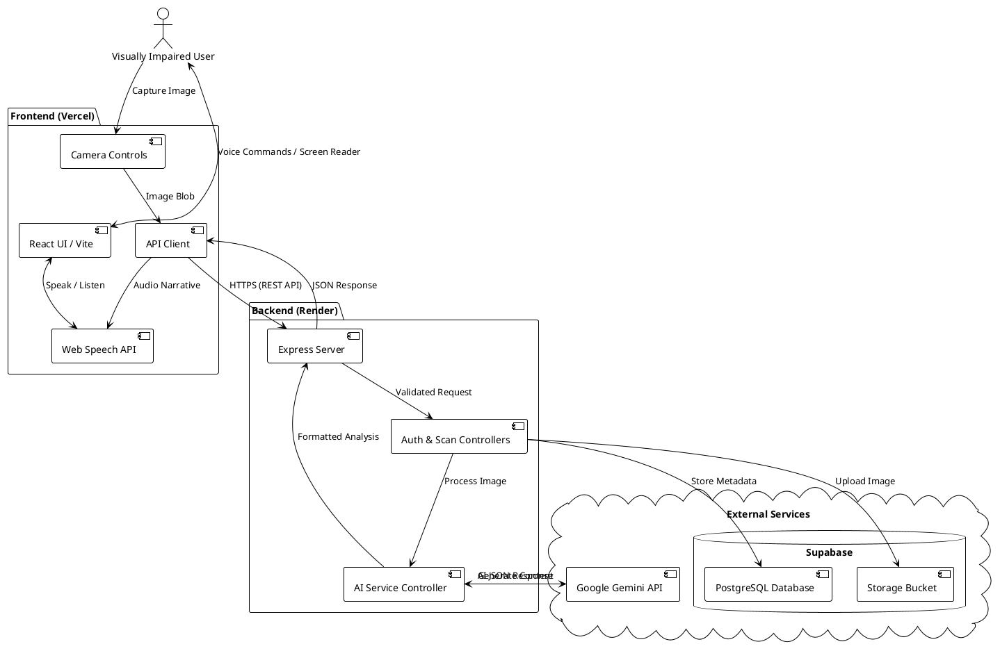

# 👁️ Drishti AI - Eyes for the Blind

An advanced, AI-powered assistive web application designed to empower visually impaired individuals by analyzing their surroundings in real-time through their device's camera.

---

## 🎯 Problem Statement
Visually impaired individuals face significant daily challenges in navigating their environments, identifying objects, reading text, and recognizing currency. Traditional assistive tools often lack real-time context or require expensive specialized hardware. There is a profound need for an accessible, voice-guided software solution that leverages modern AI to act as a "second pair of eyes" through a standard smartphone or web camera.

## 💡 Our Solution
**Drishti AI** is a fully voice-controlled, intelligent web application. By using cutting-edge Vision-Language models (Google Gemini) and native browser speech synthesis/recognition, Drishti AI allows users to:
- **Analyze Surroundings**: Get detailed auditory descriptions of rooms, layouts, and environmental hazards.
- **Read Text (OCR)**: Instantly read books, signs, or medicine labels out loud.
- **Identify Currency**: Accurately recognize and calculate the total value of Indian Rupees (INR) and international currency.
- **Find Objects**: Scan a room for specific items like keys, phones, or doors, receiving precise directional guidance (e.g., "Keys detected at 3 o'clock").
- **Voice Navigation**: Entirely navigable via voice commands like "Take a picture", "Read medicine", "Currency mode", etc.

---

## 🚀 Deployed URLs
- **Live Application (Frontend)**: [https://drishti-delta-five.vercel.app/](https://drishti-delta-five.vercel.app/)
- **Backend API Server**: [https://drishti-enda.onrender.com](https://drishti-enda.onrender.com)
- **GitHub Repository**: [https://github.com/juhipawar2323-viini/Drishti-](https://github.com/juhipawar2323-viini/Drishti-)

---

## 👥 The Team
This project was successfully built by our dedicated team:

- **Team Leader**: JUHI
- **Team Members**: 
  - LAKSHYA
  - HIMANSHU
  - ANIRBAN
  - TYEJAS

**Date & Time of Completion**: September 30, 2026, 16:55 IST

---

## 🏗️ System Architecture

Drishti AI relies on a decoupled Client-Server architecture utilizing a modern stack (React, Node.js, Express, Supabase).

### Architecture Flow Diagram


### Core Technologies:
1. **Frontend**: React.js, Vite, Tailwind CSS, Axios, Web Speech API (for STT and TTS).
2. **Backend**: Node.js, Express.js, Multer (for image handling).
3. **AI/ML**: Google Generative AI (`gemini-3.8-flash` & `gemini-3.5-flash` robust fallbacks) for multimodal image-to-text analysis.
4. **Database & Storage**: Supabase (PostgreSQL for user history, Storage Buckets for scan persistence).

---

## 📁 Project Structure & Complete Explanation

```text
Drishti-AI/
├── frontend-drishti/         # React Application
│   ├── src/
│   │   ├── components/       # Reusable UI (CameraView, SpeechControls, AnalysisResult)
│   │   ├── context/          # React Context (Auth, Accessibility)
│   │   ├── services/         # API calls, Voice Recognition, Sound Effects
│   │   ├── App.jsx           # Main routing and layout
│   │   └── main.jsx          # Entry point
│   └── vite.config.js        # Vite configuration
│
└── backend-drishti/          # Node.js Express API
    ├── src/
    │   ├── config/           # Environment and Supabase configurations
    │   ├── controllers/      # Route logic (aiController, scanController, authController)
    │   ├── middleware/       # Error handling, Auth verification, Rate limiting
    │   ├── models/           # Database models/schema references
    │   ├── routes/           # Express routers
    │   ├── services/         # Core business logic (aiService.js handles Gemini prompts)
    │   └── server.js         # Express server initialization
    └── package.json          # Backend dependencies
```

### Explanation of Core Modules:
- **`services/aiService.js` (Backend)**: The brain of the application. It receives images, determines the mode (currency, hazard, general, etc.), formulates a highly specific prompt instructing the AI on how to parse the image, and gracefully handles failovers if Google servers are overloaded.
- **`components/CameraView.jsx` (Frontend)**: Manages the device's webcam stream, optimized for mobile viewing, and handles the capture triggers.
- **`services/voiceRecognitionService.js` (Frontend)**: Continuously listens for commands using the native browser SpeechRecognition API, translating speech into app actions.

---

## ⚙️ How to Run Locally

### Prerequisites
- Node.js (v18+)
- A Google Gemini API Key
- A Supabase Project

### Backend Setup
1. `cd backend-drishti`
2. `npm install`
3. Create a `.env` file and add your `AI_API_KEY`, `SUPABASE_URL`, and `SUPABASE_ANON_KEY`.
4. `npm run dev` (Runs on `http://localhost:5000`)

### Frontend Setup
1. `cd frontend-drishti`
2. `npm install`
3. `npm run dev` (Runs on `http://localhost:5173`)
